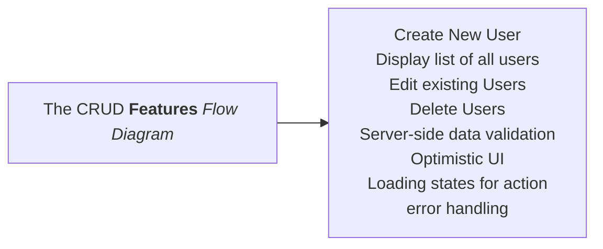

# A CRUD Application using Prisma + Postgres +Next JS

db name:: myTestdb
command: npx prisma db push

## Features implemented

```mermaid

%%{init: {"flowchart": {"htmlLabels": false}} }%%
flowchart LR
    markdown["`The CRUD **Features** _Flow Diagram_`"]
    newLines["`Create New User
    Display list of all users
    Edit existing Users
    Delete Users
    Server-side data validation
    Optimistic UI
    Loading states for action
    error handling`"]
    markdown --> newLines


```